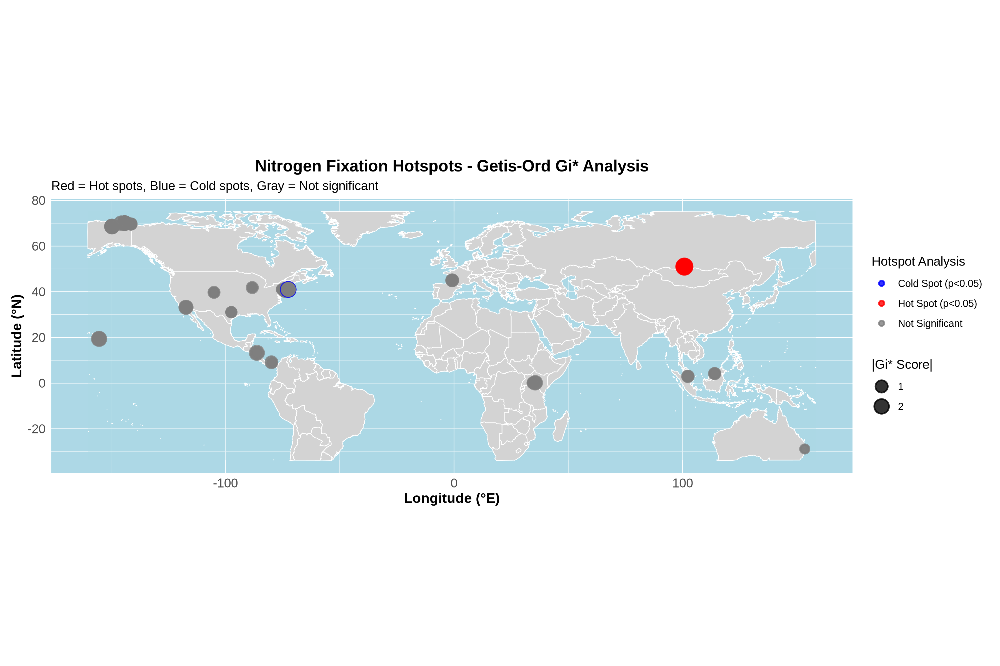
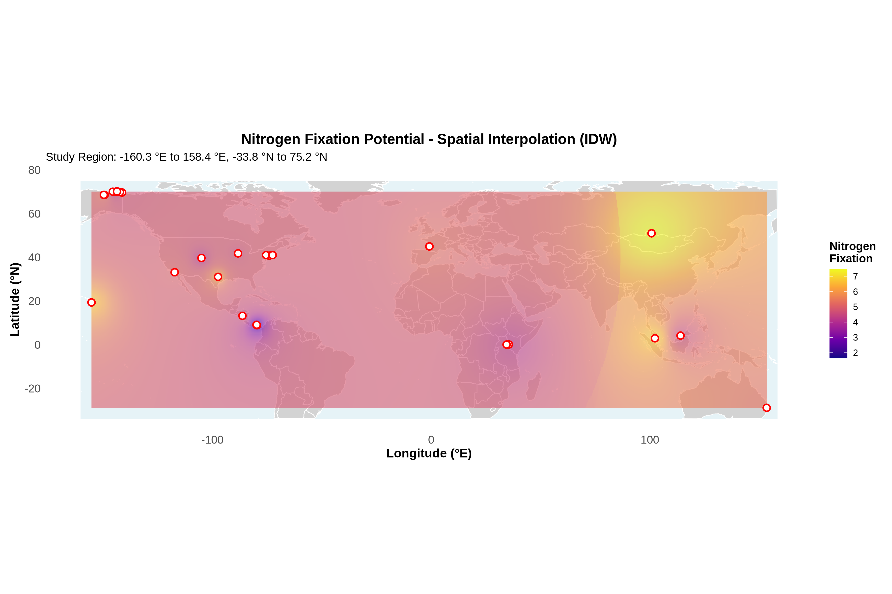
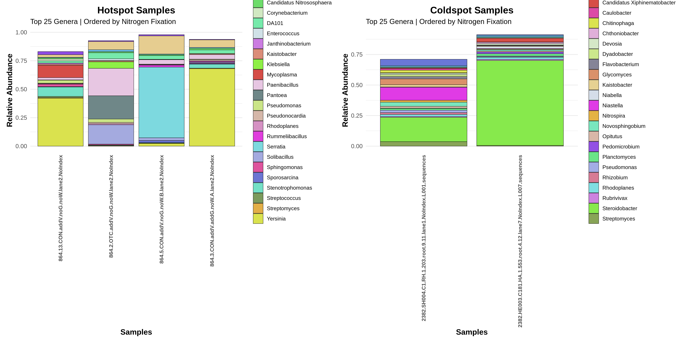
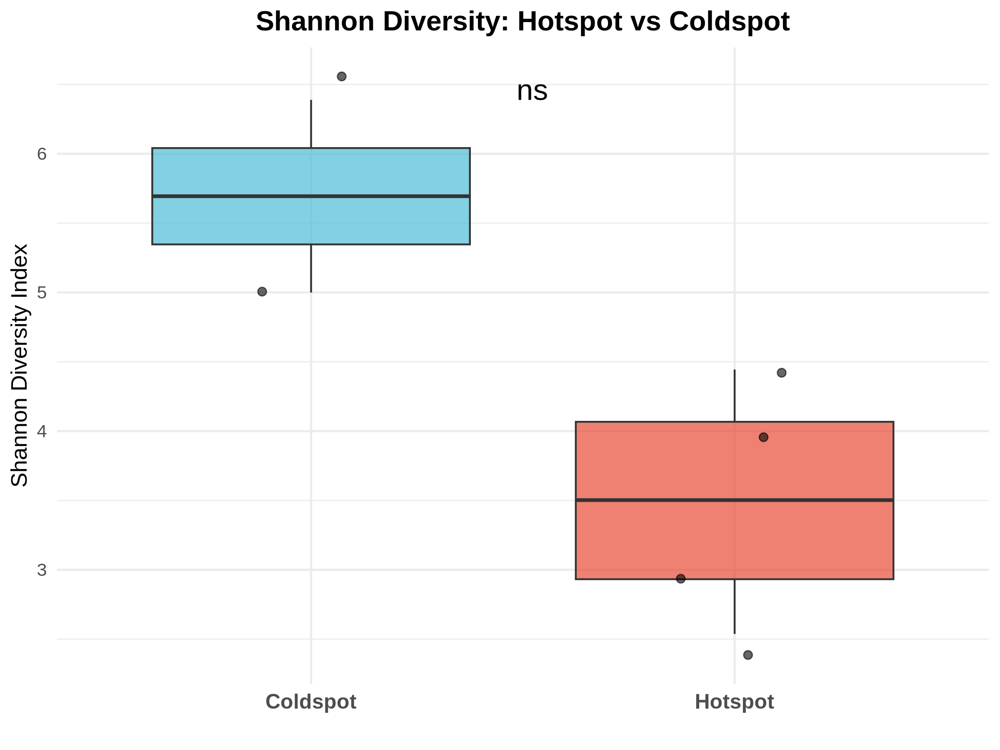
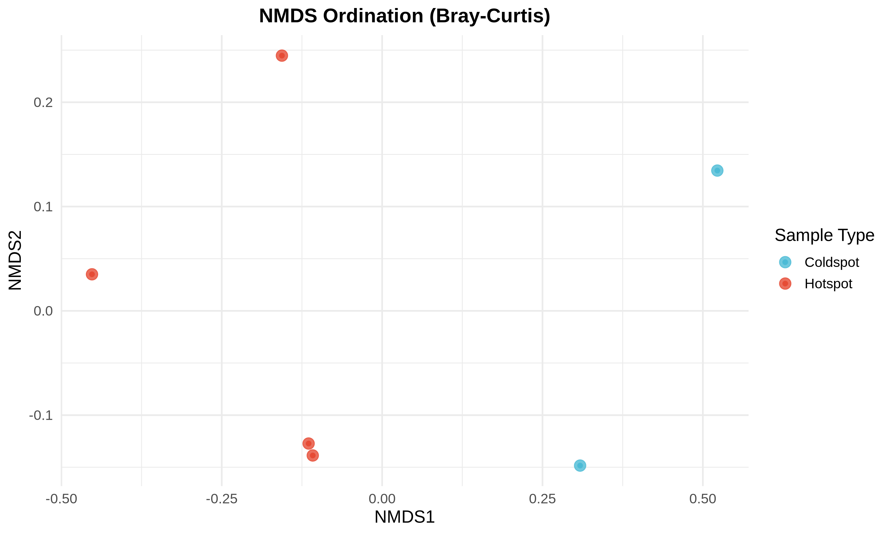

# Interpolation and Hotspot Detection: EMP Soil Dataset - Nitrogen Fixation Potential (simulated)

[](https://www.r-project.org/)
[](https://opensource.org/licenses/MIT)

A comprehensive spatial analysis workflow demonstrating interpolation, hotspot detection and community composition analysis using real microbiome data from the Earth Microbiome Project.



## 🌟 Overview

This pipeline demonstrates advanced spatial microbiome analytics using real data from the Earth Microbiome Project (EMP). The workflow integrates taxonomic data with simulated functional predictions to showcase spatial patterns in soil microbial communities across geographic landscapes.

### Key Features

- **Real microbiome data** from Earth Microbiome Project (2k soil samples)
- **Spatial interpolation** using Inverse Distance Weighting (IDW)
- **Hotspot detection** with Getis-Ord Gi* statistics
- **Community composition analysis** comparing hotspots vs coldspots
- **Cartographic visualization**
- **Statistical validation** using non-parametric tests

## 📋 Table of Contents

- [Installation](#installation)
- [Data Requirements](#data-requirements)
- [Quick Start](#quick-start)
- [Workflow Overview](#workflow-overview)
- [Methodology](#methodology)
- [Results](#results)
- [License](#license)

## 🚀 Installation

### Prerequisites
- R (≥ 4.0.0)
- RStudio (recommended)
- EMP dataset files (see [Data Requirements](#data-requirements))

### Required R Packages

```r
# Install required packages
install.packages(c(
  # Microbiome analysis
  "phyloseq", "vegan", "microbiome", "picante",
  
  # Spatial analysis
  "sf", "terra", "sp", "spdep", "gstat",
  
  # Data manipulation and visualization
  "tidyverse", "ggplot2", "patchwork", "ggpubr",
  "viridis", "RColorBrewer", "randomcoloR", "scales",
  
  # Mapping
  "maps", "leaflet"
))

# Bioconductor packages
if (!require("BiocManager", quietly = TRUE))
    install.packages("BiocManager")
BiocManager::install("phyloseq")
```

### Clone Repository

```bash
git clone https://github.com/username/spatial-microbiome-analysis.git
cd spatial-microbiome-analysis
```

## 📁 Data Requirements

### Earth Microbiome Project Files

Download the following files from the [Earth Microbiome Project](https://earthmicrobiome.org/):

```
data/
├── emp_deblur_150bp.subset_2k.biom    # OTU abundance table
└── emp_qiime_mapping_release1.tsv     # Sample metadata
```

### File Descriptions

| File | Description | Size |
|------|-------------|------|
| `emp_deblur_150bp.subset_2k.biom` | Deblurred OTU table (150bp, 2k samples) | ~50 MB |
| `emp_qiime_mapping_release1.tsv` | Sample metadata with coordinates | ~2 MB |

## ⚡ Quick Start

### 1. Generate Report

```r
# Render the R Markdown report
rmarkdown::render("microbiome_interpol_hotspots.Rmd")
```

### 2. View Results

The analysis generates several key outputs:
- `nitrogen_fixation_interpolation.png` - IDW spatial interpolation map
- `nitrogen_fixation_hotspots.png` - Hotspot analysis visualization
- `hotspot_coldspot_composition.png` - Community composition comparison
- `EMP_NitrogenFix_Interpolated.tif` - Interpolated raster data
- `EMP_NitrogenFix_Hotspots.shp` - Hotspot locations shapefile

## 🔄 Workflow Overview

### 1. Data Import and Processing
- Import EMP BIOM and metadata files
- Filter for soil samples with geographic coordinates
- Create phyloseq objects for downstream analysis

### 2. Functional Prediction Simulation
- Generate nitrogen fixation potential values
- Create realistic environmental gradients
- Link functional predictions to taxonomic data

### 3. Spatial Interpolation (IDW)
- Apply Inverse Distance Weighting interpolation
- Generate continuous spatial predictions
- Create professional cartographic visualizations
  


### 4. Hotspot Analysis (Getis-Ord Gi*)
- Identify significant hotspots and coldspots
- Assess spatial clustering patterns

### 5. Community Composition Analysis
- Compare taxonomic composition between hotspots/coldspots
- Identify top genera associated with each group
- Generate comparative visualizations
  


### 6. Diversity Analysis
- Calculate Shannon diversity indices
- Perform statistical comparisons
- Create ordination plots (NMDS)





## 🔬 Methodology

### Spatial Interpolation

The pipeline uses **Inverse Distance Weighting (IDW)** for spatial interpolation:

```r
idw_map <- terra::interpIDW(
  rast_template, 
  cbind(coords, values),
  power = 2,          # Distance weighting power
  radius = radius     # Search radius
)
```

### Hotspot Detection

**Getis-Ord Gi*** statistics identify spatial clusters:

```r
# Spatial weights matrix (k=4 nearest neighbors)
nb <- knn2nb(knearneigh(coords, k = 4))
lw <- nb2listw(nb, style = "W")

# Calculate Gi* statistic
gi_star <- localG(values, lw)
```

### Statistical Testing

- **Wilcoxon rank-sum test** for diversity comparisons
- **Significance threshold**: p < 0.05
- **Multiple comparison correction** if appropriate

## 🏷️ Keywords

microbiome, spatial analysis, Earth Microbiome Project, hotspot analysis, IDW interpolation, Getis-Ord Gi*, phyloseq, R programming, soil microbiology, nitrogen fixation, spatial statistics, biogeography

## 📧 Contact

- **Author**: Manuel García Ulloa Gamiz, PhD
- **Email**: manuel.garcia@example.com
- **LinkedIn**: [manuelgug](https://linkedin.com/in/manuelgug)
- **ORCID**: [0000-0002-6194-9565](https://orcid.org/0000-0002-6194-9565)

## 📄 License

This project is licensed under the MIT License - see the [LICENSE](LICENSE) file for details.


⭐ **Star this repository if you find it useful for your research!**
